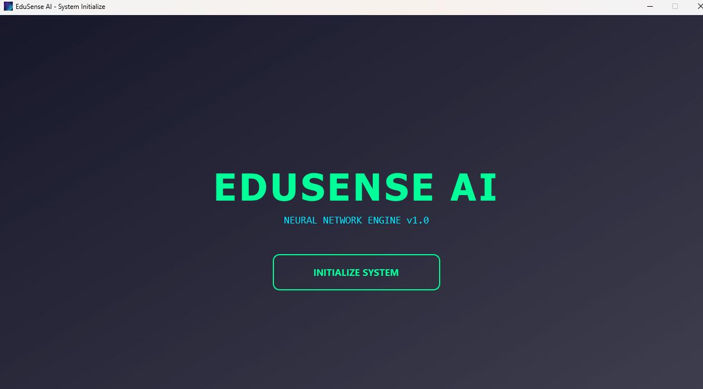
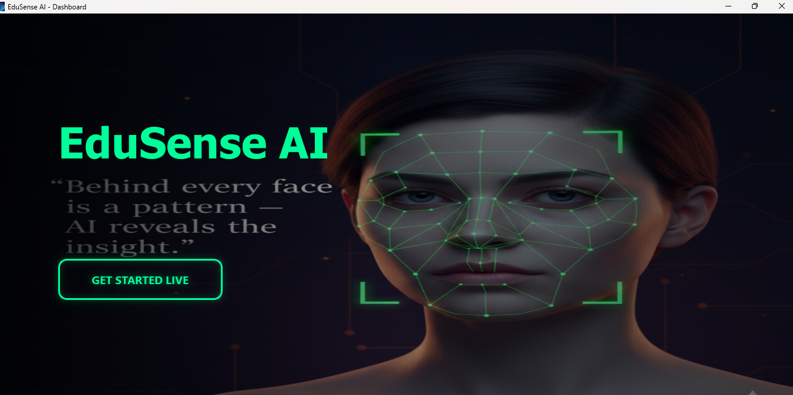
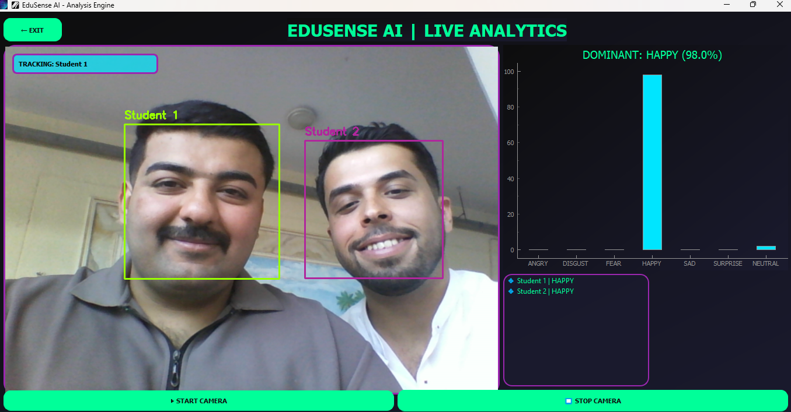

# EduSense AI 🎓

A real-time AI-powered desktop application that detects and analyzes student emotions through a live camera feed — built as a graduation project.

---

## What It Does

EduSense AI uses your webcam to detect multiple students in a classroom and analyze their facial emotions in real time. The system identifies 7 emotions for each detected face simultaneously and displays live results through an interactive bar chart.

---

## Screenshots

| Welcome Screen | Dashboard | Live Analysis |
|:-:|:-:|:-:|
|  |  |  |

---

## How It Works

1. Launch the app → Welcome screen initializes the system
2. Click **INITIALIZE SYSTEM** → loading sequence begins
3. Enter the **Dashboard** → click **GET STARTED LIVE**
4. Camera activates → AI detects all faces automatically
5. Click on any student face → track their emotions live on the chart

---

## Detected Emotions

`Angry` `Disgust` `Fear` `Happy` `Sad` `Surprise` `Neutral`

---

## Tech Stack

| Tool | Purpose |
|------|---------|
| Python | Core language |
| PyQt5 | Desktop UI framework |
| DeepFace | Facial emotion recognition |
| OpenCV | Camera feed & face detection |
| PyQtGraph | Live emotion bar chart |
| QThread | Background AI processing (no UI freezing) |

---

## Project Structure

```
EduSense-AI/
│
├── login_full_desktop.py   # Welcome & loading screen
├── dashboard.py            # Main dashboard with background slideshow
├── app.py                  # Live analysis engine (camera + AI)
├── icon.ico                # App icon
├── bg_images/              # Background images for welcome screen
└── dashboard_images/       # Slideshow images for dashboard
```

---

## Installation

```bash
# Clone the repository
git clone https://github.com/your-username/EduSense-AI.git
cd EduSense-AI

# Install dependencies
pip install PyQt5 opencv-python deepface pyqtgraph numpy

# Run the app
python login_full_desktop.py
```

---

## Key Features

- **Multi-face detection** — tracks multiple students at the same time
- **Real-time chart** — updates live as emotions change
- **Background threading** — AI runs separately so the UI stays smooth
- **Cyberpunk UI** — custom-built interface with no external UI libraries

---

## Built With ❤️ as a Graduation Project
